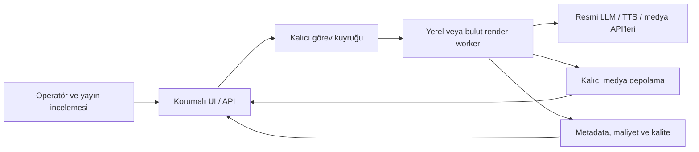

# MoneyPrinterTurbo: upstream entegrasyonu ve öğrenci araçları geliştirme planı

Araştırma tarihi: **31 Ağustos 2026**. Kapsam: yerel depo incelemesi, resmi upstream Git geçmişi, GitHub Student Developer Pack ve Google/GitHub ürün belgeleri. Bu belge uygulama veya dağıtım değildir.

Uygulama daha sonra ayrı worktree'de başladı. Bu belgedeki başlangıç gözlemleri
araştırma anına aittir; güncel test sonuçları ve tamamlanan işler
[uygulama kaydında](upstream_1_3_5_implementation_log_2026-08-31.md) tutulur.
Copilot hesabı bağlandı ve ilk test üretiminde kullanıldı; GitHub güvenlik
ayarları onayla açıldı. Entegrasyon dalı henüz GitHub'a gönderilmedi.

**Kullanıcı tercihi — 31 Ağustos:** Kullanıcı ElevenLabs'ı ücretli API olarak
kullanmıyor; genellikle ücretsiz kredilerle dışarıda ses üretip dosyayı MPT'ye
ekliyor. Ana anlatım akışı **harici ses dosyası → MPT'de altyazı/sahne/video**.
ElevenLabs API anahtarı, sağlayıcı UI kalıcılığı veya abonelik kurulumu bu
akışın gereksinimi değil; sağlayıcıya özel B5b işi ertelendi. Mevcut TTS
seçenekleri kaldırılmayacak ve kullanıcı ayarları kendiliğinden değiştirilmeyecek.
Öncelik, zaten bulunan özel ses akışında TTS'nin atlanması, dosyanın gerçek
süresinin kullanılması ve Türkçe altyazı senkronunun doğrulanmasıdır.
Ses üretilirken kullanılan özgün metin MPT'nin senaryo alanına da verilmeli;
mevcut uygulama boş senaryoyu yüklenen sesten otomatik çıkarmak yerine konu
üzerinden yeni LLM senaryosu üretebiliyor. Checkpoint kurtarmasında özel
sesin kesirli süresinin ve altyazısının korunması ayrıca doğrulanacak.

Lisans koşulu teknik yükleme desteğinden ayrıdır: ses gerçekten **Free plan**
altında üretilmişse ElevenLabs ticari kullanım lisansı vermiyor; ticari olmayan
paylaşımda da atıf istiyor. Promosyon kredisi farklı bir plan altındaysa o
planın koşulları ayrıca doğrulanmalı; kullanıcının hesap lisansı incelenmedi.
API kullanmamak bu koşulu değiştirmez. [Resmi yayın koşulları](https://elevenlabs.io/docs/help-center/legal/can-i-publish-the-content-i-generate-on-the-platform).

**B1c uygulama sonucu — 31 Ağustos:** Harici ses doğrulaması, kesinti sonrası
seçili dosya/altyazı korunması ve görünür yaklaşık zamanlama uyarısı ayrı
entegrasyon worktree'sinde tamamlandı. Dört modülde 68 yeni test eklendi;
tam paket 1.508 geçti / 13 atlandı, branch dahil coverage %71,6187 oldu.
Önbellekteki Whisper base ve sentetik Türkçe konuşmayla gerçek yerel ASR/render
kontrolü de geçti; ücretli API veya model indirme yok. Bu kısa örnek bütün
seslerde kusursuz senkron garantisi değildir. Genel %80 hedefi ve Linux CI
henüz tamamlanmış sayılmaz. Sonraki yerel dilim Docker/uv tutarlılığıdır;
ana çalışma klasörüne aktarım, push ve yayın yapılmadı. Ayrıntılar:
[uygulama kaydı](upstream_1_3_5_implementation_log_2026-08-31.md).

**Docker/uv sonucu — 1 Eylül:** B6'nın yerel CPU imajı ve C5'in yayın güvenliği
hazırlığı tamamlandı. İmaj `uv.lock` ile, dev bağımlılıkları olmadan oluşturuldu;
gerçek API/WebUI/Türkçe video kabul kontrolleri geçti. Compose artık yerel kodu
upstream `latest` ile değiştirmiyor; GHCR workflow varsayılan olarak yalnız
build/test yapıyor ve yayın için açık seçim + varsayılan dal istiyor. Uzak push,
CI/CodeQL/GHCR çalıştırması yapılmadı. GPU yapılandırması cuDNN 9'a düzeltildi,
ancak makinede NVIDIA GPU olmadığı için runtime doğrulaması açık kaldı. Son tam
paket 1.513 geçti / 13 atlandı; branch dahil coverage %71,6281.

## Karar önerisi

Mevcut yerel geliştirmeleri koruyarak **v1.3.5 değişikliklerini konu bazında taşıyalım**; ardından main dalındaki seçilmiş hata düzeltmelerini değerlendirelim. Tam merge, dosyaların üzerine kopyalama veya upstream hazır Docker imajına geçme bu depo için iyi başlangıçlar değil.

İlk araç seti GitHub'ın mevcut geliştirme olanakları, Copilot Student, mevcut Google AI Pro hesabı ve ihtiyaç doğduğunda Sentry olsun. Bulut, veritabanı ve başka platformları yalnızca ölçülmüş bir ihtiyacı çözüyorlarsa ekleyelim. Öğrenci kredilerini kalıcı işletme bütçesi saymayalım.

Varsayım: önce tek operatörlü, Türkçe içerik üreten mevcut uygulamayı iyileştiriyoruz. Çok kullanıcılı ticari SaaS ayrı bir sonraki kapsamdır. Buradaki eforlar tahmindir; hesaba özel haklar, kalan krediler, donanım performansı ve mevcut test sonuçları bu araştırmada doğrulanmadı.

## 1. Yerel deponun gerçek durumu

| Gözlem | Sonuç |
|---|---|
| Yerel dal `codex/upgrade-v1.3.1`, HEAD `9c7cab0` (29 Temmuz 2026) | Dal adı mevcut sürümü anlatmıyor. |
| `3e6eb8f`: “integrate MoneyPrinterTurbo 1.3.3 with local enhancements”; `pyproject.toml` sürümü `1.3.3` | Başlangıç noktası fiilen 1.3.3 ile yerel geliştirmeler. |
| 28 değiştirilmiş takipli dosya; 986 ekleme, 70 silme; ayrıca takip dışı `resource/branding/` | Önce mevcut çalışmaların ayrı, doğrulanmış güvenli kopyası gerekir. Sadece HEAD yedeği yeterli değildir. |
| Origin `medicanasa-hue/money-agent-work`; upstream `harry0703/MoneyPrinterTurbo` | Upstream push adresi zaten devre dışı; bu koruma korunmalı. |
| Önbellekteki `upstream/main` `42f776e` (28 Temmuz) | Yerel remote-tracking ref güncel upstream'i temsil etmiyor. |
| Canlı upstream main `6c15b42bd4435d28b280225d21f47a057a274b81` (30 Ağustos) | Araştırma için bu SHA sabitlendi; hareketli `main` sonradan değişebilir. |
| Son release v1.3.5, `5dde46390809edba44c2e8d09760623bb846fd9d`, 22 Ağustos | İlk entegrasyon hedefi. v1.3.4: 12 Ağustos. |

Sürüm tarihleri ve yayın kapsamı: [v1.3.5](https://github.com/harry0703/MoneyPrinterTurbo/releases/tag/v1.3.5), [v1.3.4](https://github.com/harry0703/MoneyPrinterTurbo/releases/tag/v1.3.4).

Git karşılaştırması ayrı geçici bare depoda yapıldı; ana deponun refs, index veya çalışma ağacı değiştirilmedi. Gerçek ortak ata `6dce9ea` (v1.3.1). Ancestry karşılaştırması yerel tarafta 9, upstream tarafında 154 commit gösteriyor; önceki elle/squash entegrasyon nedeniyle bu, **154 eksik özellik** anlamına gelmiyor. v1.3.3 ile incelenen main arasında 126 commit, 102 dosya ve yaklaşık +21.400/-912 satır farkı var. v1.3.5 sonrasında main üzerinde ayrıca 58 commit bulunuyor.

`git merge-tree` ile yalnızca commit edilmiş yerel HEAD karşılaştırıldığında v1.3.5 için **58**, main için **64** çakışan dosya görüldü. Henüz commit edilmemiş 28 dosya bu sayılara dahil değildir. Özellikle upstream'in `app/services/llm.py` ve `voice.py` dosyaları yerelde `llm/` ve `voice/` paketlerine ayrılmış; basit cherry-pick bile uyarlama gerektirebilir.

### Zaten sahip olduğumuz yetenekler

| Mevcut yapı | Kanıt / geliştirme yönü |
|---|---|
| FastAPI, Streamlit, CLI, Python >=3.11; uv kilitli bağımlılıklar | `pyproject.toml`, `.github/workflows/ci.yml`. Framework değişimi gerekmiyor. |
| Gemini LLM ve TTS | `app/services/llm/providers.py:307`, `app/services/voice/providers.py:353`. Gemini entegrasyonunu sıfırdan yazmak gerekmiyor. |
| İçerik planı, senaryo iyileştirme, viral değerlendirme | `content_intelligence.py`, `content_quality.py`, `viral_analyzer.py`. Gerçek kaynaklarla ve ölçülen sonuçlarla güçlendirilmeli. |
| İddia uyarıları | `claim_review.py:43` kurallara/regex'e dayanıyor; doğruluk doğrulayan bir araştırma motoru değil. |
| Çoklu görsel kaynak, atıf ve yerel OpenMontage köprüsü | `providers/`, `material.py`, `docs/openmontage_bridge.md`. Kendi içerik ve lisans izini korumalıyız. |
| Render kalite raporu, VMAF yardımcıları, görsel inceleme paketi | `render_quality.py`, `quality_baseline.py`. Yeni bir kalite sistemi kurmak yerine mevcut ölçümleri regresyon kapısına bağlayalım. |
| Yayın inceleme kuyruğu, zamanlanmış işler, kısa klibe dönüştürme | `upload_post.py`, `scheduled_jobs.py`, `repurpose.py` ve ilgili docs. Yayın onayı korunmalı. |
| Yayın metriği senkronizasyonu ve performans karşılaştırması | `metrics_sync.py`, `publish_insights.py`, `quality_calibration.py`. Veri olmadan başarı iddiası üretilmemeli. |
| Maliyet tahmini ve isteğe bağlı aylık sınır | `cost_estimate.py:95,214`. Karakter tabanlı tahmindir; gerçek sağlayıcı faturası veya kesin ödeme tavanı değildir. |
| Sağlayıcı hazırlık ekranı | `provider_health.py:27` ağa çıkmadan ayar hazırlığını denetler; canlı erişilebilirlik/SLA kanıtlamaz. |

Codebase-memory graph araçları bu oturumda bulunmadığından dosya araması kullanıldı. Graphify raporu 29 Haziran tarihliydi; yalnızca ikincil yön bulma amacıyla değerlendirildi. `config.toml`, `.env`, anahtarlar, kullanıcı videoları ve storage içerikleri okunmadı.

## 2. Upstream değişikliklerini nasıl alacağız?

### Öncelik sırası

| Öncelik | Değişiklik / upstream referansı | Yerel karar |
|---|---|---|
| P0 | Task dosyalarında symlink sınırı: `9f30509`; anahtar doğrulama: `28a55dd` | Mevcut kimlik doğrulama var; upstream davranışını yerel API/UI sözleşmesine uyarlayarak güçlendir. |
| P0 | Özel ses yolu: `4a82f8c`; upload doğrulama: `7003aba`; request ID: `5754ff9` | Yerel `file_security.py` ve OpenMontage izinleriyle birlikte sınır testleri yaz. Korunması gereken izinli yerel kullanım yolları var. |
| P0 | Docker bağımlılık hatasında durma: `fec2721`; FFmpeg yoksa erken hata: `9faef69` | Hatalı/eksik imajla başarılı dağıtım izlenimini önle. |
| P1 | Altyazı son satırının kesilmesi: `8cf6726` | Yerel altyazı zamanlaması ve render düzeltmelerini koruyarak port et. Türkçe karakterlerle doğrula. |
| P1 / sağlayıcı kısmı ertelendi | Bind-mounted config: `e5bb283`; tekrarlı BOM: `1339ee8`; ElevenLabs anahtar kalıcılığı: `01def3b` | Genel config düzeltmeleri korunur. ElevenLabs'a özel anahtar/UI kalıcılığı kullanıcının harici ses akışı için gerekli değil. Özel config'i kopyalama. |
| P1 | Kuyruğa verme başarısızlığında durum geri alma: `17b7b3f`; eski queue parametreleri: `254cd02`; pozitif limitler: `93c0365` | Yerel task manager ve testlerle davranış eşdeğerliğini kontrol et; aynı korumayı iki kez ekleme. |
| P1 | ElevenLabs müzikte sınırlı yanıt okuma/kaynak yönetimi: `3a96206` | Yerel limitler kısmen mevcut; hata gövdesinin sınırsız okunması ve stream kapanması ayrı testle tamamlanmalı. |
| P1 | Arama sonucu cache'i: `95dd03e`; kaynak manifesti: `7ddb11d`; Whisper prompt: `2588821` | Yerel indirilmiş dosya cache'i arama cache'iyle aynı değil. Yeni modülleri mevcut lisans/atıf alanlarıyla birleştir. |
| P1 | Gemini ses kataloğu: `89fe953`; MiniMax/Fish Audio; Claude sağlayıcısı | Gemini kataloğu yüksek fayda; yeni ücretli sağlayıcıları gereksinim varsa, kapalı varsayılanla ekle. |
| P1 | Preset transferi: `696f007`; UI ayar kalıcılığı: `3f5842b`; sosyal açıklamalar: `e4f53d1` | Mevcut preset, metadata ve inceleme akışı ile birleştir. Anahtarlar varsayılan export'a dahil edilmesin. |
| P2 | WaveSpeed / Shengsuan üretken video; main'deki Seedance / APIMart / OpenRouter | Tamamını etkinleştirme. Önce tek sağlayıcı, örnek kalite kıyası ve ücret onayı. |
| P2 | Yeni diller / doküman / sponsor kaynakları | Türkçe çevirileri koru; ürün için gerekli olmayan tanıtım değişiklikleri öncelik değil. |

Commitler resmi depoda `https://github.com/harry0703/MoneyPrinterTurbo/commit/<SHA>` ile izlenebilir. Ana inceleme aralığı: [v1.3.3 → v1.3.5](https://github.com/harry0703/MoneyPrinterTurbo/compare/v1.3.3...v1.3.5). Yukarıdaki sıralama bizim mimariye göre mühendislik önerisidir.

### Release sonrasından ayrıca değerlendirilecek düzeltmeler

- Windows CLI Unicode çıktısı: `fe29211` + testi `6c15b42`. Türkçe kullanım nedeniyle yüksek değer.
- Senaryoda parantezler arasındaki fazla metni silen greedy regex: `8e1add3`. Yerel `llm/scripts.py:185` içinde ilgili desenler mevcut; anlamlı Türkçe parantezli ifadeler de korunmalı.
- Ses süresini gerçek dosyadan ölçme: `b4c2810`; SiliconFlow altyazı sonunu ses sonuna bağlama: `a41d7cb`; AudioFileClip kaynaklarını kapatma: `0e9e64a`.
- Güvenli indirme dosya adı: `85d321d`; parolasız Redis URL: `c88e864`.
- Upload-Post bağlantısı ile otomatik yayını ayırma: `248f658`. Bizde inceleme kuyruğunun davranışı korunmalı.
- Headless sunucuda tarayıcı önizlemesi: `58c341b`; sunucu denemesi yapılacaksa yararlı.
- CLI batch manifest: `b3599f6`, yan etkisiz ön kontrol: `50091bd`, null alan reddi: `0bfb0bc`. Mevcut scheduled jobs ile eşleştirilmeli; ayrı bir geliştirme dilimi.

Tüm main dalı alınmayacak; seçilen her düzeltmenin bağımlılıkları ve testleri kontrol edilecek. Referans: [v1.3.5 → incelenen main SHA](https://github.com/harry0703/MoneyPrinterTurbo/compare/v1.3.5...6c15b42bd4435d28b280225d21f47a057a274b81).

### Güvenli uygulama ve geri dönüş

1. Başlangıç envanteri: commit, diff, takip dışı varlık listesi ve bağımlılık sürümleri. Mevcut 28 değişikliği incele; tamamlanmış olanları yerel koruma commitlerine ayır veya güvenli patch/yedekle. Secret ve storage için Git dışı güvenli yedek kullan; içeriklerini rapora yazma. OpenMontage ignore altında olduğu için Git yedeğine güvenme.
2. `codex/integrate-upstream-v1.3.5` gibi ayrı bir dal/worktree oluştur. Mevcut dirty çalışma ağacını taşımak için `reset`, zorlayıcı checkout veya kör `stash` kullanma.
3. Önce değişiklik öncesi test ve kısa yerel video referansını al. Test sonucu bilinmeden hatanın entegrasyondan kaynaklandığını varsayma.
4. P0'dan başlayarak küçük commitler halinde taşı. Her commit açıklamasına kaynak upstream SHA ve yerel uyarlama gerekçesi ekle; kanıt tablosunda `alındı / zaten var / ertelendi / uyarlanacak` durumunu tut.
5. `pyproject.toml`, `uv.lock`, legacy `requirements.txt` birlikte tutarlı olsun. Yereldeki `python-multipart 0.0.31`, `ruff 0.15.22` ve Pillow override'ını upstream dosyasını kopyalayarak geriye düşürme; uyumluluk ve güvenlik denetimiyle karar ver.
6. Ücretli API ve gerçek yayın kapalı staging kullan. Ayrı storage ve Redis namespace gerekir. Ücretli test ancak tutarı ve kapsamı belirlenip onaylandığında yapılmalı.
7. Kendi GHCR namespace'imizden üretilmiş, commit SHA/digest ile sabitlenmiş imajı dene. Mevcut release compose upstream `latest` imajını seçiyor; bu imaj yerel geliştirmelerin dağıtıldığını kanıtlamaz.
8. Eski imaj + uyumlu config + veri yedeğine dönüş provası yap. Migration varsa geri okunabilirlik/dönüş prosedürü ayrıca doğrulansın. Push, yayın ve dağıtım bu planın uygulanması için ayrıca açık yetkilendirme gerektirir.

## 3. Kalite ve güvenlik kapıları

Mevcut CI Linux Python 3.11/3.13 üzerinde pytest ve branch coverage, Windows üzerinde unittest smoke çalıştırıyor. `pyproject.toml` gerçek coverage eşiği **%70**; repo talimatlarında ise hedef **%80**. Bu araştırmada testler çalıştırılmadı ve ölçülmüş yeni coverage sonucu yok. Önce mevcut baseline alınmalı, yeni/değişen modüllerde %80 hedeflenmeli ve bütün depo eşiği gerçek ölçümle %80'e yükseltilmeli; test atlayarak veya kapsam daraltarak oran artırılmamalı.

Keşfedilmiş mevcut komutlar (uygulama aşamasında, izole ortamda):

```powershell
uv sync --frozen
uv run --no-sync python -m compileall app cli.py main.py webui test
uv run --no-sync ruff check app cli.py main.py webui test
uv run --no-sync python -X utf8 -m coverage run -m pytest -q test
uv run --no-sync python -m coverage report
```

Haftalık dependency audit zaten `requirements.txt` üzerinden çalışıyor; kilitli ana bağımlılıklarla tutarlılığı korunmalı. Windows smoke'un pytest fonksiyonlarını da kapsaması ayrıca doğrulanmalı.

Kritik test matrisi:

- API ve `/tasks`: eksik/yanlış/doğru anahtar, loopback/dış host/proxy topolojisi, task dizininden çıkan symlink, request ID, Unicode dosya adları ve izin dışı ses dosyası.
- Yerel video: Türkçe `ç, ğ, ı, İ, ö, ş, ü`, çok satırlı altyazı, son satır kesilmesi, son cümlenin ses bitişi, özel ses, no-voice, 9:16 ve 16:9 çıktı.
- Görsel kaynak: attribution/provenance korunması, doğru yönelim, kaynak boşluğu, timeout/429, yerel OpenMontage için doğal en-boy oranı ve dil seçimi.
- İş yaşam döngüsü: kuyruk dolu, başlatma hatası, yarıda kalan iş, restart, retry, inceleme bekleyen yayının otomatik gönderilmemesi.
- Preset/config: eski sürümden okuma, bind mount, BOM, export'ta sır bulunmaması, Türkçe etiket parity.
- Dağıtım: kendi imajımız, beklenen SHA, olmayan FFmpeg'de anlamlı hata, başarılı rollback. Küçük sentetik medya testi dış servis kullanmadan çalışmalı.

Mevcut auth ve dosya kontrolleri var; uygulamanın şu anda internete açık olduğu saptanmadı. Compose portları loopback'e bağlı. Bununla birlikte `app/asgi.py:158` üzerinde `follow_symlink=True` ve host'a bağlı output-auth politikası, dış erişimden önce incelenmesi gereken sınırlar. Bunlar dar kod incelemesi bulgularıdır; uzaktan exploit gösterimi yapılmadı.

Redis kullanımı da tek başına dağıtık worker güvenilirliği sağlamıyor: mevcut sayaç/kilit süreç içinde, Redis kuyruğu `RPUSH/LPOP` kullanıyor. Birden fazla render worker açılmadan önce lease/ACK, crash recovery, atomik kapasite sınırı ve ücretli çağrılarda idempotency gerekir. İlk aşamada tek worker korunmalı.

Sağlayıcı idempotency sunmuyorsa, kabul edilmiş bir ücretli çağrının sonucu kaydedilemeden bağlantı kopması halinde kesin bir kez çalışma garantisi verilemez. Bu belirsiz durumlar otomatik yeniden ücretlendirme yerine uzlaştırma/insan incelemesine alınmalı.

## 4. GitHub Student Developer Pack: neyi kullanmalı?

Paket kataloğu ve sağlayıcı koşulları birlikte kontrol edildi. Katalogda yer almak, hesabın ilgili hakkı etkinleştirdiğini veya her ürünün aynı süre/lisansla kullanılabildiğini göstermez. Türkiye, okul, yaş, mevcut abonelik ve ödeme doğrulaması sağlayıcı bazında değişebilir. Aşağıdaki öncelikler projeye uygunluk değerlendirmesidir.

### En yararlı seçenekler

| Araç | Güncel hak / sınırlama | Projeye uygulama ve öneri |
|---|---|---|
| **GitHub Pro + Actions** | Pro: aylık 3.000 Actions dakikası ve 1 GB Actions storage. Kişisel Pro organizasyonu Team yapmaz. [Kotalar](https://docs.github.com/en/billing/reference/product-usage-included) | Mevcut CI'ı kullan. Küçük test render'ı, güvenlik denetimi, coverage ve inceleme kapıları. Video arşivini Actions artifact'larında tutma. |
| **Codespaces** | Pro: 180 çekirdek-saat/ay, 20 GB-month. 2 çekirdekte yaklaşık 90 saat; daha büyük makine daha hızlı tüketir. [Faturalama](https://docs.github.com/en/billing/concepts/product-billing/github-codespaces) | Windows dışındaki temiz Linux kurulumunu doğrula. Geliştirme ortamıdır; sürekli render/hosting önerisi değildir. Boşta durdurma ve storage yaşam süresini sınırla. |
| **Sentry** | Bir yıl ücretsiz; sağlayıcı bugün aylık 50K hata, 5 GB log, 5M span, 500 replay, 1 cron monitor, 1 GB ek ve $20 Seer kredisi gösteriyor. [Education](https://sentry.io/for/education/) | En yararlı ilk dış servis. Job/stage/provider/sürüm/süre etiketleriyle hata ayıklama. Script, anahtar, video ve özel dosya yolu gönderme; replay/ek yükleme kapalı başlasın. |
| **Doppler** | Aktif öğrencilere Team aboneliği. [Öğrenci programı](https://www.doppler.com/secretsops-for-students) | İkinci ortam/CI/staging anahtarları ortaya çıktığında ekle. Şimdilik tek cihaz için yeni zorunlu servis yaratma. Mevcut config loader ile güvenli secret injection tasarlanmalı. |
| **CodeScene** | Öğrenci hesabı; katalog özel GitHub depoları analizini de kapsıyor. [Sağlayıcı](https://codescene.com/resources/github-students), [katalog](https://education.github.com/pack) | Sık değişen, karmaşık ve çatışan dosyaları önceliklendirme. Başlangıçta danışman raporu; tüm repo refactor veya keyfî puan hedefi yok. Private repo erişimi ayrı onay/izin incelemesi gerektirir. |
| **Azure for Students** | $100 / 12 ay, kart gerekmez; uygun öğrencilikte yıllık yenileme. Yaş/eğitim şartları var. [Microsoft Learn](https://learn.microsoft.com/en-us/azure/education-hub/about-azure-for-students) | Bir staging deneyi, Blob Storage ve Azure Speech kalite kıyası. Tüm krediyi sürekli açık VM'ye harcama. Aylık $100 değildir; yıllık tutarın aylık aritmetik ortalaması yaklaşık $8,33. |
| **Camber** | Katalog: aylık 40 CPU saati, 5 GPU saati, 50 GB storage, 50 agent mesajı. [Katalog](https://education.github.com/pack), [sağlayıcı](https://www.cambercloud.com/github-student-pack) | Whisper veya seçilmiş batch görevinde küçük deney. FFmpeg/font/GPU encoder desteği, CPU saat birimi ve dışa aktarma önce doğrulanmalı. Ana üretim hosting'i sayma. |
| **BrowserStack** | Bir yıllık öğrenci erişimi. Katalog 1 kullanıcı/1 paralel Automate Mobile derken sağlayıcı Live seçeneklerini de gösteriyor. [Teklif](https://www.browserstack.com/github-students) | Android/iOS'ta yükleme, video oynatma, indirme, uzun Türkçe etiketler. Playwright'ın yerine geçmez; bütün masaüstü/otomasyon ürünlerinin dahil olduğunu varsayma. |
| **Name.com / Namecheap** | Name.com seçilmiş uzantılarda bir yıl; ödeme yöntemi ve ücretli yenileme var. Namecheap katalogda bir yıllık .me + SSL. [Name.com](https://www.name.com/de-de/partner/github-students), [katalog](https://education.github.com/pack) | Ürün/demo hazır olduğunda tek alan adı. Yenileme fiyatını ve ek güvenlik paketinin ayrı ücretini önceden kaydet. İlk yıl fiyatına göre marka/domain bağımlılığı kurma. |
| **GitKraken / GitLens** | 6 ay ücretsiz, sonra öğrenci indirimi; tek koltuk. [Güncel koşullar](https://help.gitkraken.com/gk-dev/gk-dev-student-pack/) | Bu entegrasyonda dal ve commit tarihini anlamak için yararlı. Öğrencilik boyunca sınırsız ücretsiz varsayımı yanlış; Git'in zorunlu bağımlılığı olmasın. |
| **JetBrains / PyCharm** | Yıllık yenilenebilir öğrenci lisansı; ticari olmayan eğitim/akademik araştırmayla sınırlı. [Lisans karşılaştırması](https://www.jetbrains.com/store/comparison.html), [paket](https://www.jetbrains.com/academy/student-pack/) | Debugging/refactor için iyi. Gelir getiren proje üzerinde kullanımda öğrenci lisansını otomatik uygun sayma. Mevcut editör verimliyse geçiş şart değil. |
| **Educative / DataCamp** | Educative 6 ay seçilmiş 70+ kurs; DataCamp 3 ay, ilgili yeni kullanım/abonelik şartları var; kart gerektirmeyen akışlar. [Educative](https://www.educative.io/github-students), [DataCamp](https://support.datacamp.com/hc/en-us/articles/26715178032151-How-to-Get-3-Months-of-Free-Access-to-DataCamp-with-GitHub-Student-Benefits) | İlkine Docker/test/API güvenliği, ikincisine video performansı/maliyet analizi için bak. Süreleri gerçekten kullanılacak dönemde başlat. |
| **Heroku** | 24 ay boyunca ayda $13; devretmez, kart ve 18+ gerekir, aşım ücretlidir; üçüncü taraf add-on'lar hariç. [Güncel teklif](https://www.heroku.com/github-students/) | Hafif demo/API için alternatif. Küçük kotanın render işçisine yettiğini varsayma; ayrı kalıcı storage olmadan çıktı saklama. |

Sentry katalog metnindeki eski transaction birimleriyle sağlayıcının yeni span/log birimleri uyuşmuyor; etkinleştirme ekranındaki haklar son kontrol noktasıdır. Heroku'nun bazı eski belgelerindeki 12 ay yerine güncel teklif 24 ay diyor. Sayfalarda açık olmayan kart/yenileme şartları ücretsiz veya otomatik aşım yokmuş gibi yorumlanmadı.

Public depolardaki standart Actions runner ücretsizliği genel GitHub özelliğidir; sadece öğrenci avantajı değildir. Büyük runner ve ek ürünlerin ücretsizliği varsayılmamalı. [Actions faturası](https://docs.github.com/en/billing/concepts/product-billing/github-actions)

### Şimdilik ertelemeyi önerdiklerim

| Araç | Hak / uygunluk | Erteleme gerekçesi |
|---|---|---|
| **MongoDB Atlas** | $50 kredi; redemption için kart/PayPal, kullanılmamış kod için 90 gün süresi. [Students](https://www.mongodb.com/students) | Sırf kredi için kalıcılık katmanını değiştirme. Çok kullanıcı/iş geçmişi gereksinimi doğarsa veri modeliyle birlikte seç. Videolar metadata veritabanında tutulmamalı. |
| **Appwrite Education** | 2 Pro eşdeğer proje; ticari/eğitim dışı kullanım yasak. Eski 10 proje bilgisi güncel değil. [Koşullar](https://appwrite.io/education), [Nisan değişikliği](https://appwrite.io/changelog/entry/2026-04-07) | Eğitim prototipi için kullanılabilir; gelir getiren ürünün kalıcı ücretsiz backend'i olarak seçme. FastAPI'yi değiştirmek gerekmiyor. |
| **Clerk** | Tek workspace, öğrencilik süresince Pro eşdeğeri ve 50K monthly retained user; SMS hariç. [Koşullar](https://clerk.com/github-student-developer-pack) | Çok kullanıcılı üründe değerlendir. Streamlit login, FastAPI token doğrulama ve kullanıcıya ait dosya erişimi birlikte tasarlanmalı. |
| **Datadog** | Katalogda 10 sunuculu Pro / 2 yıl. [Katalog](https://education.github.com/pack), [sağlayıcı FAQ](https://www.datadoghq.com/partner/datadog-for-startups/) | Birden fazla worker olduğunda sistem metrikleri için. Başlangıçta Sentry ile üst üste servis kurma; tüm log/APM ürünleri dahil sanma. |
| **LocalStack** | Öğrenci AWS emülasyonu ve aylık 1.000 CI/CD kredisi. [Sağlayıcı](https://www.localstack.cloud/localstack-for-students) | AWS S3/SQS seçilirse testlerde yararlı. AWS hosting kredisi değildir. |
| **Polypane** | Bir yıl; non-commercial öğrenci teklifi. [Koşullar](https://polypane.app/github-students/) | Eğitim prototipinde erişilebilirlik ve responsive kontrolü; ticari lisans ayrıca gerekir. |

**DigitalOcean mevcut bütçeye dahil edilmemeli.** GitHub'ın resmi duyurusuna göre öğrenci teklifi 31 Temmuz 2026'da kapandı, kalan krediler 1 Ağustos'ta sona erdi. Eski $200/yıl rehberleri bugün bu plan için geçerli değil. [GitHub Education duyurusu](https://github.com/orgs/community/discussions/201240)

Travis'i mevcut Actions'ın yanına eklemek, React'e sırf bir tasarım aracı ücretsiz diye geçmek, üç farklı DB/auth/izleme hizmetini aynı anda kurmak önerilmiyor. Visme/IconScout gibi araçlar tasarım varlıklarına yardımcı olabilir; sınırsız medya API'si veya bütün varlıklar için yeniden dağıtım hakkı anlamına gelmez.

Azure nüansı: Ayrıntılı teklifteki eğitim/non-commercial kısıtlarının bir bölümü özellikle **Software Download Benefits** altında. Buradan bütün Azure compute için kesin ticari yasak sonucu çıkarılmadı. Bu planda Azure dev/test için öneriliyor; ticari hizmette kullanılacak her ürünün sözleşmesi ayrıca incelenmeli. [Azure teklif koşulları](https://azure.microsoft.com/en-us/pricing/offers/ms-azr-0170p/)

## 5. Copilot ve Google AI Pro'yu birlikte kullanmak

### Geliştirme sırasında devreye alma — 31 Ağustos ek kararı

Bu araçlar C aşamasının bitmesini beklememeli. Copilot ile kod/test yazma,
GitHub Actions ile doğrulama ve CodeQL ile güvenlik incelemesi **entegrasyonla
aynı anda** kullanılacak geliştirme iş akışıdır. Sentry, Doppler ve bulut
hosting ayrı uygulama/hesap bağlantısı işleridir; onların sonraya kalması
geliştirme araçlarının da erteleneceği anlamına gelmez.

GitHub API kontrolü: `medicanasa-hue/money-agent-work` public; varsayılan dal
`codex/upgrade-v1.3.1`. İlk kontrolde kapalı olan Secret scanning, depo push
protection, Dependabot alerts ve security updates **kullanıcının açık onayıyla
etkinleştirildi**. Alerts endpointi dependency graph'ı da açtı. Son GET
kontrolünde alerts HTTP 204, security updates `enabled: true, paused: false`
ve iki secret protection ayarı `enabled`. Otomatik merge kapalı kaldı.
CodeQL default setup hâlâ `not-configured`; hazırlanan advanced workflow
henüz gönderilmedi. Sürüm güncelleme YAML'ı ile hesap özelliğinin gerçekten
etkinleşmesi ayrı ayrı doğrulandı.

| Araç | Bu entegrasyondaki somut iş | Hazırlık / gerçek kullanım durumu |
|---|---|---|
| Copilot Student | Python tamamlama; tek davranışa yönelik regresyon testi; küçük diff incelemesi | CLI 1.0.82, ayrı hesap `yusufyigitozdamar`. İlk gerçek iş: FFmpeg kalite ölçümü test taslağı; inceleme ve eklemeler sonrası 44 test geçti. Tek istek 1,360044 AI kredi raporladı. GitHub CLI depo hesabı `medicanasa-hue` ayrı kaldı. Repo talimatları hazır; VS Code 1.128.1 içindeki Chat 0.56.0 için editör oturumu hâlâ doğrulanmadı. |
| GitHub Actions | Linux 3.11/3.13 ve Windows testleri, Ruff, coverage, sentetik render | Mevcut CI hazır; push filtresine gerçek varsayılan dal eklendi. Yeni değişiklikler gönderilmediği için bu paketin GitHub sonucu yok. |
| CodeQL | Python'da güvensiz veri akışı ve dosya/komut sınırı incelemesine ek kontrol | SHA sabitli `.github/workflows/codeql.yml` hazır. Standart Ubuntu runner, PR/default branch/haftalık tetikleme, sınırlı token izinleri. Henüz analiz çalışmadı. |
| Dependabot | uv, Actions ve Docker sürüm önerileri; testlerden sonra insan incelemesi | Alerts, dependency graph ve security updates açık; güncelleme hizmeti duraklatılmamış. Mevcut haftalık config korunuyor. Güvenlik PR'ları oluşabilir; otomatik merge kapalı. |
| Secret scanning / push protection | Depo secret uyarıları ve desteklenen sırları içeren push'ların kontrolü | Kullanıcı onayıyla iki depo ayarı etkinleştirildi, GET ile doğrulandı. Tarama sonuçlarının tamamlandığı veya hiç açık bulunmadığı iddia edilmiyor. |
| GitLens / CodeScene | Önce upstream commit geçmişi; gerekirse sık değişen karmaşık dosyaların önceliklendirilmesi | GitLens öğrenci süresi kontrol edilecek. CodeScene hesabı/depo bağlantısı yapılmadı; ihtiyaç halinde ayrı değerlendirme. |
| Codespaces | Yerelde açıklanamayan Linux kurulum veya platform farkını tekrar üretme | CI yetmezse kota kontrollü ortam; şu anda Codespace oluşturulmadı. |

Public depoda **standart** GitHub-hosted runner kullanımı ücretsizdir; larger
runner, özel depo ve başka ürünlerin ücretleri aynı varsayımla değerlendirilmez.
Code scanning public depolar için kullanılabilir. Bu iki avantaj yalnızca
Student Pack'e bağlı değildir.
[Actions ücretlendirmesi](https://docs.github.com/en/billing/concepts/product-billing/github-actions),
[Code scanning uygunluğu](https://docs.github.com/en/code-security/concepts/code-scanning/code-scanning).

Yerel kurulum ve öğrenci hesabına ayrı giriş:

**CLI kurulumu ve ayrı hesap bağlantısı tamamlandı.** İlk kontrolün
`medicanasa-hue (via gh)` ve 0/200 AIC sonucu öğrenci olmayan depo hesabına
aitti; kredi sayısı tek başına Student hakkını kanıtlamaz. Kullanıcı,
tarayıcıdaki Student hesabının farklı olduğunu açıkladı.

Ardından `copilot login --web-flow` ile kullanıcı tarayıcı onayını tamamladı:
`Signed in successfully as yusufyigitozdamar.` Boş geçici klasörde, model
araçları/MCP/uzak paylaşım kapalı ikinci kontrolde `/user` artık
`yusufyigitozdamar` gösterdi; `/usage` sıfır mesaj ve 0/200 AIC bildirdi.
`gh api user` ise depo hesabının hâlâ `medicanasa-hue` olduğunu doğruladı.
Kullanıcı gerekirse bu depo hesabının da değişmesine izin verdi; şu anda
Copilot ayrı giriş kullandığı için buna gerek kalmadı. Bu oturum doğrulamasında
kredi harcanmadı; daha sonraki ilk kodlama isteği aşağıda ayrı kaydedildi.

Aşağıdaki ilk iki adım tamamlandı; yalnız yeni kurulum veya oturum sorunu
olursa tekrarlanmalı. VS Code girişi ise editörde kullanmak isteyen kullanıcı
için ayrı ve isteğe bağlıdır:

1. [Education benefits](https://github.com/settings/education/benefits) üzerinden
   öğrenci hakkının bağlı olduğu hesapta Copilot Student etkinliğini kontrol et.
   Yalnız ücretli seçenek varsa satın alma yapma; Education onayı ile Copilot
   etkinleşmesi ayrı adımlar olabilir.
   [Resmi öğrenci rehberi](https://docs.github.com/en/copilot/how-tos/copilot-on-github/set-up-copilot/enable-copilot/set-up-for-students).
2. Açılmış Copilot OAuth akışında öğrenci hakkının bulunduğu tarayıcı hesabını
   seçip girişi kendin tamamla. Akışı yeniden başlatmak gerekirse yeni bir
   terminalde `copilot login --web-flow` kullan. Parola, token veya tek
   kullanımlık kodu sohbetle paylaşma; ayrı Copilot OAuth girişi için gh repo
   hesabını değiştirmek gerekmiyor.
   CLI 1.0.82 yardımında yerel masaüstü için varsayılan tarayıcı OAuth akışı
   doğrulandı; `--device-code` ayrı seçenektir. Mevcut gh oturumu kullanılabilse
   de bu, Student hakkının doğrulandığı anlamına gelmez.
3. Editörde kullanmak istersen VS Code'da Copilot simgesinden **Use AI Features**
   veya **Sign in to use Copilot** ile öğrenci hesabında oturum aç. Yerleşik Chat
   mevcut olduğundan eski `GitHub.copilot` paketini zorla kurma/downgrade etme.
   [VS Code kurulumu](https://code.visualstudio.com/docs/setup/copilot).

Actions, CodeQL ve Dependabot için ayrı masaüstü programı gerekmez. Secret
protection ve Dependabot özellikleri ayrı kullanıcı onayıyla açıldı; bu
ayar değişikliği hazırlanan dalı göndermedi veya CodeQL çalıştırmadı.

Copilot'ta ilk iş tamamlandı: yalnız `app/utils/video_quality.py` kaynağı ve
sınırları yazılı test görevi boş geçici klasörden gönderildi. Araçlar, MCP,
custom instructions ve uzak paylaşım kapalıydı; Copilot diskte dosya
değiştirmedi. Dönen taslak gözden geçirilip düzeltildi, test dosyasına alındı.
Bu koşu `.github/copilot-instructions.md` dosyasının otomatik yüklendiğine
dair bir doğrulama değildir; ilgili kısıtlar prompt içinde açıkça verildi.

Kullanım raporu `totalNanoAiu=1360044000`: **1,360044 AI kredi**,
görüntülenen 200 kredilik hakkın yaklaşık %0,68'i. Bu yalnız bu koşunun
ölçümüdür; hesapta kalan kredinin veya faturanın yeni sorgusu değildir.
`totalPremiumRequestCost=1` ayrı muhasebe alanıdır, 1 AI kredi diye okunmaz.
Auto model seçti; sabit model veya reasoning effort zorlanmadı.
[Resmi kullanım metrikleri](https://github.com/github/copilot-sdk/blob/main/docs/features/usage-and-billing.md#accumulated-ai-credit-and-token-totals).

Sonraki dar repo görevi için kullanılabilecek şablon:

> AGENTS.md ve .github/copilot-instructions.md kurallarını oku. Yalnızca sana
> atanan modül ve ilgili test dosyasında çalış; başka ajanların değişikliklerine
> dokunma. Mevcut coverage raporundan kullanıcı davranışını etkileyen bir eksik
> hata yolunu seç. Var olan testleri tekrar etmeden regresyon testi ekle; bir
> hata düzeltmesi gerekiyorsa önce RED, sonra en küçük GREEN değişikliği yap.
> Üretim davranışını yalnızca coverage için değiştirme. Coverage eşiğini
> düşürme, test atlama veya canlı API çağırma. Çalıştırılan komutları, sonucu ve
> diff'i göster; commit/push yapma.

Modül ve test dosyası görev başında somut olarak atanmalı; bu şablon bütün
depoyu aynı anda düzenleme yetkisi değildir. İkinci kullanım salt okunur
inceleme: "Yalnız verilen diff'teki auth, path sınırı ve kaynak kapatma
regresyonlarını incele; dosya/satır ve tekrar üretme adımlarıyla raporla;
dosya değiştirme." Copilot'ın talimatları kullandığı desteklenen istemcide
yanıt referanslarından kontrol edilmeli.
[Repo talimatları](https://docs.github.com/en/copilot/how-tos/copilot-on-github/customize-copilot/add-custom-instructions/add-repository-instructions).

**Güvenli yayın sırası:** Entegrasyon dalının değişiklikleri önce yerelde
incelenecek, ardından açık push/PR onayıyla GitHub kontrolleri çalıştırılacak.
Mevcut `docker-ghcr.yml` hâlâ upstream `ghcr.io/harry0703/moneyprinterturbo`
hedefine main/tag push ile yayın deniyor. Bu düzeltilmeden main/tag gönderimi
veya Docker publish çalıştırması yapılmamalı. Yeni CI/CodeQL hazırlığı herhangi
bir imajı yayımlamadı veya uzak hesap ayarını değiştirmedi.

### Copilot Student

Doğrulanmış öğrencilere ücretsiz **Copilot Student** var; bunu Copilot Pro'nun tüm haklarıyla eşitlememeliyiz. GitHub'ın güncellenmiş öğrenci duyurusu aylık **200 AI Credits**, sınırsız kod tamamlama ve **yalnız Auto model seçimi** belirtiyor. Eski 300 premium request bilgisiyle kapasite planlanmamalı. [Öğrenci duyurusu](https://github.com/orgs/community/discussions/189268)

AI kredileri token/model kullanımına göre tüketiliyor; sabit mesaj sayısı değil. 1 kredi $0,01 ölçümlenen kullanım karşılığı; başka API'ye taşınan nakit bakiye değil. Kullanılmayan aylık hak devretmiyor. [Bireysel faturalama](https://docs.github.com/en/copilot/concepts/billing/usage-based-billing-for-individuals)

Student'da editör agent mode, CLI, cloud agent ve code review özellikleri listeleniyor; üçüncü taraf partner ajanlar dahil değil. Mevcut Codex erişimi ayrı kalır. İncelemeler ayrıca Actions dakikası tüketebilir. Bu nedenle Copilot'ı günlük tamamlama, küçük test ve sınırlı diff incelemesine ayırmak önerilir. [Planlar](https://docs.github.com/en/copilot/get-started/plans), [Haziran billing değişikliği](https://github.blog/changelog/2026-06-01-updates-to-github-copilot-billing-and-plans/)

Nisan'daki kayıt duraklaması güncel engel olarak sunulmamalı; GitHub 17 Haziran'da Student dahil kayıtların kademeli yeniden açıldığını duyurdu. Education doğrulamasından sonra Copilot'ın ayrı etkinleştirilmesi gerekebilir. Hesapta ücretli satın alma görünürse ücretsiz hakkın yerleştiğini doğrulamadan ödeme yapılmamalı. [Duyuru](https://github.blog/changelog/2026-06-17-copilot-individual-plan-sign-ups-are-reopening/), [etkinleştirme rehberi](https://docs.github.com/en/copilot/how-tos/copilot-on-github/set-up-copilot/enable-copilot/set-up-for-students)

### Google AI Pro: birbirinden ayrı haklar

| Katman | Hakkın anlamı | Projede kullanım |
|---|---|---|
| **Gemini uygulaması / Deep Research** | Daha yüksek etkileşimli araştırma erişimi. Sabit eski günlük mesaj sayıları yerine güncel hesaplama limitleri geçerli. [Deep Research](https://support.google.com/gemini/answer/15719111?hl=en), [limitler](https://support.google.com/gemini/answer/16275805?hl=en) | Teknik araştırma, içerik kaynaklarının karşılaştırılması, Türkçe kalite rubriği. Kaynaklar yine kontrol edilir. |
| **NotebookLM / güncel belgelerde Gemini Notebook** | Onaylı belgelerden proje bilgi defteri. [AI Pro hakları](https://support.google.com/googleone/answer/14534406?hl=en) | Sürüm notları, bizim mimari kararlar ve kaynaklı içerik notları. Özel config/storage yüklenmez. |
| **Antigravity IDE/CLI** | Bireysel Pro geliştirme erişiminin güncel yolu. 18 Haziran'da eski tüketici Gemini CLI/Code Assist yolu sonlandı; ücretli API/kurumsal yollar ayrı devam ediyor. [Resmi geçiş](https://developers.googleblog.com/en/an-important-update-transitioning-gemini-cli-to-antigravity-cli/) | Ayrı worktree'de bağımsız inceleme veya UI kontrolü. Aynı dosyalarda eşzamanlı iki yazıcı çalıştırma. |
| **AI Studio Playground / Build** | Pro'nun web arayüzünde daha yüksek deneme erişimi; doğrudan API tier'ından farklı. [Resmi ayrım](https://ai.google.dev/gemini-api/docs/google-ai-plans) | Aynı Türkçe senaryo setinde prompt ve yapılandırılmış JSON denemesi. Beğenilen prompt daha sonra uygulamaya taşınır. |
| **Developer Program** | AI Pro için aylık **$10 Cloud kredisi**; developer profili, uygun hesap ve aktivasyon koşulları. [FAQ](https://developers.google.com/profile/help/faq), [benefits](https://developers.google.com/profile/help/benefits) | Küçük Cloud/API deneyi. Eski bağımsız Premium'un yıllık $500/sertifika hakları otomatik dahil sanılmamalı. |
| **Gemini runtime API** | MoneyPrinterTurbo'nun API key ile çağırdığı ayrı proje, kota ve billing. | Mevcut `google-genai` adapter'ını geliştir; tüketici oturum çerezi veya chat arayüzünü uygulama backend'i yapma. |
| **Flow** | Pro'da ayda **1.000 ayrı Flow kredisi**; API bütçesi değil. [Flow kredileri](https://support.google.com/flow/answer/16526234?hl=en) | Az sayıda özgün B-roll/intro üretip dosyayı mevcut yerel medya akışına al. Tüm videoyu ücretli üretilmiş sahnelerden kurmak şart değil. |
| **Flow Music** | AI Pro belgesi Plus hakkı, aylık **10.000 ayrı müzik kredisi** ve ticari kullanım hakkı listeliyor. Hesap/bölge etkinliği ayrıca doğrulanmalı. [Google One](https://support.google.com/googleone/answer/14534406?hl=en), [planlar](https://www.flowmusic.app/pricing) | Özgün fon müziğini manuel üretip içe aktar. Kullanılan üçüncü taraf ses/örnek hakları ayrıca kontrol edilir; bu bir otomatik müzik API kredisi değildir. |

Pro'nun API'ye etkisi “her şey ücretsiz” veya “hiç API avantajı yok” şeklinde özetlenemez: web kullanım hakkı ayrıdır, uygun Developer Program Cloud kredileri ise etkinleştirildiğinde API harcamasına uygulanabilir. Hesaptaki gerçek tanımlama görülmeden bütçeye kesin gelir olarak yazılmamalı.

Güncel Gemini billing, prepay'e atanan hesaplarda en az **$10** ön ödeme isteyebiliyor. Uygun promosyonun uygulanması için pozitif prepay bakiye gerekebilir. Yeni **$300 Cloud Welcome** kredisi Gemini API/AI Studio için uygun değil. Proje harcama sınırlarında gecikme/uzun işlerden kaynaklı aşım mümkün; sağlayıcı kontrolüne ek uygulama rezervasyonu gerekiyor. [Billing](https://ai.google.dev/gemini-api/docs/billing)

AI Studio içindeki API tabanlı Deep Research/Antigravity ajanlarının erişimi de tüketici aboneliğindeki etkileşimli araştırmayla aynı hak değildir. İlk aşama araştırma ve medya üretimi manuel, uygulama tarafı resmi API ve açık bütçe ile ilerlemeli. [Google AI plans](https://ai.google.dev/gemini-api/docs/google-ai-plans)

### Somut iş bölümü

| İş | Önerilen araç / sorumluluk |
|---|---|
| Upstream farklarını taşıma, bağımlılıklar, testler ve son diff | Mevcut Codex; entegrasyonda tek sorumlu |
| Günlük Python tamamlama ve küçük test üretimi | Copilot Student |
| Alternatif mimari değerlendirme / teknik araştırma | Gemini Deep Research; öneriyi doğrudan kod talimatı saymadan |
| Onaylanmış sürüm notları ve karar arşivi | Gemini Notebook |
| Bağımsız hata incelemesi / UI denemesi | Gerektiğinde Antigravity, ayrı worktree |
| Senaryo/JSON prompt karşılaştırması | AI Studio; sonra ölçülmüş API deneyi |
| Görsel ve müzik varlıkları | Flow/Flow Music, manuel üretim ve kontrollü yerel import |

Jules veya Copilot cloud agent, ileride küçük ve açık görevlerde kullanılabilir. Bu araştırmada repo bağlanmadı, uzaktan ajan görevlendirilmedi. İlk faydayı almak için tüm araçları kurmaya gerek yok.

### Mahremiyet kuralları

- Ücretsiz Gemini API/AI Studio yollarında içerik ürün geliştirmede kullanılabilir; hassas veri gönderilmemeli. Ücretli hizmetlerin veri kullanımı farklıdır; Türkiye için Avrupa bölgesindeki istisnaları varsayma. [Gemini API koşulları](https://ai.google.dev/gemini-api/terms)
- Gemini uygulamasında etkinlik ayarı/geçici sohbet sıfır kayıt garantisi değildir. [Gizlilik merkezi](https://support.google.com/gemini/answer/13594961?hl=en)
- Copilot kişisel politika ayarları, public-code eşleşmeleri ve repo erişimleri kontrol edilmeli. Öğrenci üyeliği kurumsal gizlilik sözleşmesine eşit değildir. [Kişisel politikalar](https://docs.github.com/en/copilot/how-tos/manage-your-account/manage-policies)
- `.gitignore` veya `.dockerignore` dosyası bir AI aracına tüm özel dosyaların gitmesini otomatik engellemez. Paylaşılabilir context açıkça seçilmeli: sentetik fixture, maskelenmiş log, gerekli kaynak dosyaları.
- Secret kasası bağlama, anahtar değiştirme, cloud hesap bağlantısı veya yeni servise özel repo erişimi verme bu turda yapılmadı; bunlar scoped uygulama adımlarıdır.

## 6. Projeyi gerçekten geliştirecek ürün işleri

Aşağıdakiler aboneliklerin hazır MoneyPrinterTurbo özellikleri değil; mevcut koddan hareketle önerilen ürün geliştirmeleridir. Başarı ölçütleri öneridir, ölçülmüş sonuç değildir.

### 6.1 Kaynaklı senaryo ve iddia incelemesi

Mevcut `claim_review.py` yalnız şüpheli ifade türlerini işaretliyor. Bunu kaynak başlığı, URL, yayın/erişim tarihi, desteklediği iddia ve inceleme durumu bulunan bir kaynak paketiyle genişletelim. RSS/content intelligence'da mevcut kaynak alanlarından yararlanalım. Script önerisi üretildiğinde sayı, tarih, finans veya sağlık iddiaları kaynaklara bağlansın; kaynak bulunamaması açıkça görülsün. LLM'nin ürettiği bir URL, kontrol edilmeden doğrulanmış kaynak sayılmasın.

İlk akış: Gemini'de araştır → insanın kaynakları doğrulaması → referanslı notları uygulamaya import → senaryo önerisi → insan incelemesi. Daha sonra ancak faydası kanıtlanırsa programatik arama/API ekleyelim. Yayın onayı hâlâ insanda kalsın. Kabul: kaynak verisi history/export'ta korunur; kaynak bulunamadığında uygulama bunu gizlemez; yeniden yazım orijinal senaryoyu ezmez.

### 6.2 Düzenlenebilir sahne planı

Mevcut sahne arama sorgularını bir adım ileri götür: her sahnede anlatım, yaklaşık süre, görsel amaç, materyal türü, aday kaynaklar ve atıf olsun. Kullanıcı render'dan önce stok video / OpenMontage / kendi medyası / gerektiğinde Flow çıktısı arasında seçim yapabilsin. Bu, yalnızca çok sayıda model eklemekten daha doğrudan kontrol sağlar.

İlk dilim tek sahneyi değiştirmek ve önizlemek olsun. Ayrı yeni frontend yerine mevcut Streamlit kontrolleri ve `DESIGN.md` izlenmeli. Kabul: sahne değişikliği diğer sahneleri bozmaz; materyal yetersizse açık uyarı oluşur; lisans/atıf alanları kaybolmaz.

### 6.3 Türkçe ses ve altyazı kalite paketi

Whisper `initial_prompt` desteği, marka/terim telaffuz sözlüğü, sayı ve kısaltmaların konuşma biçimi, gerçek ses uzunluğu ve altyazı güvenli alanlarını birlikte ele al. Önce upstream süre/son satır hatalarını düzelt; ardından bu özellikleri ekle. Edge, mevcut Gemini TTS ve gerekiyorsa Azure Speech'i aynı kısa metinlerde kıyasla. Bunlar her biri ayrı fiyat/erişim politikasına sahip servislerdir.

Örnek değerlendirme seti önerisi: 20 kısa Türkçe metin; özel isim, yüzde, tarih, kısaltma ve karmaşık cümleler. Kör dinleme puanı, yanlış telaffuz sayısı, son kelimenin kesilmesi, altyazı taşması ve maliyet/süre kaydedilsin. “Daha doğal” iddiası bu örnekler üzerinde gösterilmeden varsayılan sağlayıcı değişmesin.

### 6.4 Gerçek kullanım ve bütçe denetimi

Mevcut tahmin ekranını koru; gerçek `input/output token`, ses/video birimi, model, fiyat sürümü, retry ve stage sürelerini ayrı kaydet. Ölçüm yoksa `bilinmiyor` yaz; başarısız denemeleri maliyetsiz kabul etme. Sağlayıcı fallback'i daha pahalıysa sessiz geçiş olmasın.

Bütçe kontrolünün uygulanacağı sınır bütün girişlerin ortak kullandığı ücretli servis çağrıları olmalı; yalnız scheduled CLI'daki geçmişe dayalı kontrol yeterli değil. Yeni iş için rezervasyon → gerçek kullanım ile uzlaştırma → kalan rezervasyonu bırakma akışı tasarlanmalı. Kabul: eşzamanlı işler aynı bakiyeyi iki kere harcama izni alamaz; fiyatı bilinmeyen ücretli aşama açık politika olmadan başlamaz; kullanıcıya tahmin ile gerçekleşen ayrı gösterilir.

### 6.5 Yeniden üretilebilir kalite kıyası

Mevcut render kalite paketi ve baseline yardımcılarını kullan. Sabit yerel medyayla 9:16/16:9, farklı font/altyazı, özel ses ve sessiz mod örnekleri oluştur. Bunlar pull request'te küçük testler, release öncesi daha kapsamlı render kontrolleri olarak çalışabilir. Dış TTS/LLM istemeyen deterministik örnekler otomatik; ücretli kalite deneyleri ayrı olsun.

Kabul: aynı giriş setinde önce/sonra galeri bulunur; beklenen çözünürlük, codec, süre ve ses varlığı doğrulanır; siyah/donmuş sahne ve altyazı taşmaları manuel incelemeyi tetikler. Render kalitesi, erişim veya viral başarıyla eş anlamlı değildir.

### 6.6 Yayın geri bildirimi ve marka paketleri

Mevcut `publish_insights`, `metrics_sync` ve `review_feedback` verilerine dil, süre, hook türü, ses ve görsel politika gibi karşılaştırma alanlarını tutarlı ekle. Küçük örneklerde sonuçları yalnız gözlem olarak göster; korelasyonu neden-sonuç veya viral garanti diye sunma. Otomatik paylaşım açmadan öneri sun.

Marka preset'i; font, altyazı görünümü, intro/outro, atıf şablonu ve lisansı kayıtlı BGM içerebilir. Flow Music veya kendi üretilen müzik dosyası mevcut local/BGM hattıyla alınabilir. Bu, yeni bir ücretli API entegrasyonundan önce düşük maliyetle denenebilir. Kabul: tek preset'le tutarlı çıktı; başka projeye ait özel anahtar veya lisanssız varlık export edilmez.

## 7. İş listesi, bağımlılıklar ve doğrulama

Her satır bir küçük iş veya açıkça ayrılmış alt iş ailesidir. Hedef tek oturum ve en fazla yaklaşık 5 dosya; belirtilen aile birden çok sağlayıcıya/ekrana yayılırsa **her sağlayıcı veya UI bağlantısı ayrı işe ayrılmalı**. Dosya adları mevcut yollar veya açıkça belirtilen yeni taslaklardır. Test sütunundaki adlar `test/services/` altında, aksi belirtilmedikçe mevcut test modülleridir. Yeni testler ilgili davranışı doğrulamalı; uygulamanın aynısını kopyalayan testler yazılmamalı.

### A — Güvenli temel ve P0 düzeltmeler

| İş | Kabul ölçütü ve doğrulama | Bağımlılık / muhtemel dosyalar |
|---|---|---|
| A1: Yerel durum koruması | 28 değişiklik, branding ve Git dışı gerekli kaynaklar geri getirilebilir; secret Git'e girmez. Diff/yedek manifesti ve örnek geri yükleme kontrolü. | Yok; Git metadata ve güvenli yerel yedek. |
| A2: Baseline | Gerçek test/coverage sonucu ve bilinen hatalar kayıtlı; kısa deterministik video referansı var. Bölüm 3 komutları + yerel fixture. | A1; mevcut CI/testler, bu planın takip kaydı. |
| A3: Task dosya sınırı | Dış symlink/path traversal reddedilir; izinli preview/download akışı çalışır. Static/auth testleri. | A2; `asgi.py`, `test_api_auth.py`, yeni `test_asgi_static_files.py`. |
| A4: Request ID ve API auth | Path-safe ID, yanlış anahtar ve proxy senaryoları doğrulanır; mevcut rate limit korunur. `test_controller_base`, `test_api_auth`. | A2; `controllers/base.py`, iki test modülü. |
| A5: Upload doğrulama | Yanlış tür, boyut, dosya adı ve yol reddedilir; geçerli materyal alınır. `test_controller_video` + güvenlik fixture'ları. | A3/A4; `controllers/v1/video.py`, `file_security.py`, gerekiyorsa yeni küçük upload yardımcı modülü, test. |
| A6: Özel ses sınırı | API izin dışı dosyayı açamaz; yerel CLI ve geçerli yükleme çalışır. `test_schema`, `test_task` veya alt modüller. | A3; `schema.py`, `task.py`, iki test; CLI bağlantısı gerekirse ayrı A6b. |
| A7: Kuyruk hata davranışı | Bozuk eski parametre worker'ı düşürmez, başarısız schedule takılı state bırakmaz. `test_task_manager`, controller task testleri. | A2/A4; manager modülleri ve testler. Controller state bağlantısı ayrı A7b. |

**Kontrol noktası A:** Başlangıç testlerine göre gerileme yok; güvenlik davranışları testli; ücretli API/yayın kapalı. Public staging için A'nın yanı sıra B6/B6b'deki P0 başlangıç/Docker kontrolleri ve C5'teki kendi imajımız şartı da tamamlanmalı.

### B — Kullanıcının ürettiği videoyu etkileyen düzeltmeler

| İş | Kabul ölçütü ve doğrulama | Bağımlılık / muhtemel dosyalar |
|---|---|---|
| B1: Gerçek ses süresi | Son kelime kesilmez; hata halinde dosya handle'ı kapanır. `test_task`, `test_voice`. | A2; `task.py`, `voice/providers.py`, iki test. |
| B1c: Harici anlatım sesi — yerelde tamamlandı | 68 yeni test; WAV/MP3 ve normalizasyonla gerçek FFmpeg render; önbellekteki Whisper base ile kısa Türkçe ASR örneği geçti. Geçersiz ses erken reddediliyor; kesinti sonrası seçili ses ve düzeltilmiş altyazı korunuyor; tahmini zamanlama UI'de belirtiliyor. Uzun/gerçek kullanıcı kayıtları için kalite kontrolü ayrı. | A6/B1/B3; `task.py`, `Main.py`, 9 dil sözlüğü ve dört `test_custom_audio_*` modülü. Sonuçlar uygulama kaydında; ana klasöre aktarım/push yapılmadı. |
| B1b: ElevenLabs kaynak sınırı | Büyük hata yanıtı sınırlı okunur, stream her durumda kapanır. `test_elevenlabs_music`. | A2; `elevenlabs_music.py`, `test_elevenlabs_music.py`. |
| B2: Senaryo regex'i | Birden fazla parantezli bölüm arasında normal metin kaybolmaz. `test_llm` ile Türkçe fixture. | A2; `llm/scripts.py`, `test_llm.py`. |
| B3: Altyazı geometri/timeline | Çok satır ve Türkçe harfler kesilmez; final cue ses sınırını aşmaz. `test_video`, `test_voice`, görsel fixture. | B1; `video.py` ve testleri; ses timeline ayrı B3b. |
| B4: Windows Unicode / indirme | Başarılı CLI sonunda encoding hatası yok; indirme adları güvenli. `test_cli`, `test_controller_video`. | A4; `cli.py`, controller, iki test. |
| B5a: Genel config davranışı | BOM/bind mount ve genel ayar kalıcılığı örnek config ile doğrulanır. `test_config`; mevcut düzeltmeler korunur. | A2; `config/config.py`, `test_config.py`; gerçek kullanıcı config'i değişmez. |
| B5b: ElevenLabs UI/anahtar kalıcılığı — ertelendi | Yalnız kullanıcı ileride API kullanımını isterse ele alınır; harici ses yüklemenin veya entegrasyonun ön koşulu değildir. | B5a; sağlayıcı UI ve testleri. Bu karar hesap/abonelik değişikliği yapmaz. |
| B6: FFmpeg/Docker fail-fast — yerel CPU tamamlandı | Eksik FFmpeg erken duruyor; digest-pinned Python 3.11.16 imajı uv lock ile gerçek oluşturuldu. Ağsız Türkçe render/API/WebUI kontrolleri geçti. GPU runtime donanım olmadığı için açık. | `Dockerfile`, `Dockerfile.gpu`, `docker-compose*.yml`, container kabul testi ve uygulama kaydı. |
| B7: Gemini ses kataloğu / Whisper prompt | Katalog seçimi geriye uyumlu; initial_prompt gerektiğinde iletilir. `test_voice`, `test_subtitle`. | B1/B3; discovery ve testi; subtitle/config işi ayrı B7b. |

**Kontrol noktası B:** Aynı yerel medya üzerinde önce/sonra çıktı karşılaştırması tamam; ses ve altyazı regresyonları yok; tüm mevcut üretim girişleri çalışıyor.

### C — Entegrasyonu tamamlama ve güvenilir yayın hattı

| İş | Kabul ölçütü ve doğrulama | Bağımlılık / muhtemel dosyalar |
|---|---|---|
| C1: Arama cache'i — C1a yerelde tamamlandı | Pexels/Pixabay tek/çok kaynak video aramasında sayfa, hesap, proxy ve TLS ayrımı olan 24 saatlik süreç içi önbellek; filtreleme yeniden çalışır. Yeni modül kapsamı %96; tam yerel suite 1.601 geçti. | Diğer sağlayıcılar/fotoğraflar ve kalıcı disk cache'i ayrı işler olarak açık. Ayrıntılar uygulama kaydının C1a bölümünde; GitHub kabulü PR'da izlenir. |
| C2: Kaynak manifesti | Yerel lisans/atıf bilgileri ve sanitize provenance tek şemada korunur. `test_material`, `test_task`. | C1; task artifacts yardımcı modülü, material/task bağlantısı ve testler ayrı dilimler. |
| C3: Preset kalıcılığı | Eski preset açılır; varsayılan export secrets içermez. `test_presets` ve UI testleri. | B5a; `presets.py`, `Main.py`, iki test. Ertelenen ElevenLabs B5b işi engel değildir. |
| C4: Sosyal açıklamalar | Platform metni üretilir ama inceleme/disclosure/attribution atlanmaz. `test_llm`, `test_upload_disclosure_review`. | C2; `llm/social.py`, task bağlantısı ve testler. |
| C5: Kendi imajımız — yayın hazırlığı tamam, uzak çalışma bekliyor | Workflow repo adından tam SHA tag üretir, aynı imajı ağsız test eder; release Compose açık `MPT_IMAGE` SHA/digest ister ve upstream latest kullanmaz. Yerel CPU imajı geçti; gerçek GHCR digest ancak açık push/yayın onayı ve başarılı workflow sonrası vardır. | Workflow/Compose/actionlint/digest seçimi yerelde doğrulandı. Uzak çalıştırma yok; GPU runtime ve rollback sonraki kapı. |
| C6: CI/rollback | Windows pytest koleksiyonu kapsamlı; dependency audit tutarlı; eski imaja dönüş denenmiş. CI ve staging kanıtı. | C5; `ci.yml`, audit workflow, `test/README.md`, gerektiğinde `pyproject.toml`. |

**Kontrol noktası C:** İstenen upstream davranışlarının durum tablosu tamam. Taşınmayan özellikler açıkça listeli; sürüm “tüm main entegre” diye sunulmuyor. Yeni/değişen kritik modüller %80 coverage hedefini karşılıyor; bütün depo için %80 farkı ayrı işler halinde ölçülüyor.

### D — İyileştirmeler, ihtiyaç kanıtlandıkça

| İş | Kabul ölçütü ve doğrulama | Bağımlılık / muhtemel dosyalar |
|---|---|---|
| D1: Hata telemetrisi | Stage/sürüm/süre var; sentetik secret/prompt telemetry'de görünmüyor. SDK scrub testi; yetkili staging deneyi. | C; yeni küçük telemetry modülü, task hook, config örneği, test. |
| D2: Kullanım ölçümü | Gemini adapter'ından gerçek usage metadata alınır, eski string arayüzü korunur. `test_llm` + yeni usage testi. | C; providers, yeni usage modülü, history ve testler. Diğer adapter'lar ayrı işler. |
| D3: Bütçe rezervasyonu | Eşzamanlı iş, bilinmeyen fiyat ve retry politikası testli. Sahte provider ile sınır testleri. | D2; cost/budget modülü, ortak çağrı sınırı ve testler; UI/API bağlantıları ayrı alt işler. |
| D4: Kaynak paketi | İddia-kaynak ilişkisi kaydedilir, eksik kaynak görünür. `test_claim_review`, `test_content_quality`. | C2; claim/content modülleri, history ve test; UI import ayrı alt iş. |
| D5: Tek sahne düzenleme | Bir sahne değiştirilip önizlenebilir, geri kalanı korunur. Birim + Playwright akış testi. | D4; yeni scene-plan modülü, schema/test; Main bağlantısı ayrı alt iş. |
| D6: Marka/BGM preset'i | Lisans ve atıf korunur; key export yok; aynı preset tekrar üretilebilir. Preset/BGM testleri. | C3; preset/BGM/history bağlantıları ve testler. |
| D7: Kalite/maliyet deneyi | Önerilen 20 Türkçe örneğin kalite, süre ve maliyeti yan yana raporlu. Ücretli deney için ayrı limit/onay. | D2/B7; test fixture'ları ve benchmark raporu; sağlayıcı başına ayrı deneme. |
| D8: Dayanıklı worker pilotu | Crash sonrası görev kurtarılır; belirsiz ücretli çağrı/yayın sonucu otomatik tekrarlanmaz. Redis entegrasyon, uzlaştırma ve restart testleri. | C/D3; önce lease/ACK sözleşmesi, sonra queue modülü/test, ardından worker giriş noktası ayrı işler. |

D8 yalnızca paralel/uzak üretim gereksinimi oluştuğunda uygulanmalı. SaaS auth, ödeme, çok kiracılı veri izolasyonu veya yeni frontend bu listeye gizlice eklenmemeli; ayrı ürün kararıdır.

### Efor ve sıra

Planlama tahmini olarak A+B için yaklaşık **12–20 odaklı oturum**, C için **6–10 oturum** ayırmak makul. Bir oturum yaklaşık 1–2 saatlik küçük uygulama/test işidir; başlangıç test hataları ve anlamsal çatışmalar bu aralığı artırabilir. D işleri topluca taahhüt edilmemeli; en yüksek faydalı 2–3 tanesi seçilip ayrı tahminlenmeli. Bunlar tamamlanma garantisi veya ölçülmüş geliştirme süresi değildir.

Önce A ve B; bağımsız paket hak envanteri bunlarla paralel yapılabilir. C1 → C2 → C4 sıralı bir zincirdir; C3 bu zincirle, dosya çakışması yoksa paralel ilerleyebilir. Aynı `Main.py`, `task.py` veya provider dosyasında tek yazıcı olmalı. Deploy ve DB/queue migration işleri sıralı ilerlemeli.

## 8. Çalıştırma mimarisi ve maliyet yaklaşımı

İlk tercih **yerel render + mevcut Streamlit/FastAPI**. Kullanıcı uzaktan erişim istediğinde önce tek, korunan staging ortamı. Mevcut WebUI `webui_task.py` üzerinden yerel thread/manager kullanıyor; aşağıdaki ayrım şu anda tamamlanmış değildir, gelecekteki hedef tasarımdır:



Başlangıçta W kullanıcının mevcut bilgisayarı olabilir; web arayüzünün küçük sunucuda çalışması ağır videonun da aynı sunucuda render edilmesi anlamına gelmez. Uzak worker tasarlanırsa ortak dosya sistemi varsayımları, güvenli dosya transferi, TTL/temizlik, göreve erişim ve retry ele alınmalı. Video transferinin maliyeti/mahremiyeti de değerlendirmeye dahil edilmeli.

Heroku dosya sistemi geçicidir ve dyno'lar arasında paylaşılmaz; kalıcı çıktı için ayrı storage gerekir. [Heroku dosya sistemi](https://devcenter.heroku.com/articles/dyno-isolation)

Önerilen maliyet modeli:

`video maliyeti = LLM + TTS + üretken medya + render işlem süresi + depolama + veri çıkışı + başarısız denemeler`

Kredi miktarını benchmark olmadan “şu kadar video”ya çevirmeyelim. CPU sayısı, RAM, codec, sahne sayısı, hedef çözünürlük ve Whisper kullanımı sonucu değiştirir. GPU bulunması bütün MoviePy hattını hızlandırma garantisi değildir.

| Senaryo | Seçim | Kaçınılacak varsayım |
|---|---|---|
| İlk güvenilir sürüm | Yerel render, mevcut hesaplar; GitHub testleri, ihtiyaç varsa Sentry | Elektrik, mevcut API tüketimi ve depolama dahil her şey sıfır maliyetli değildir. |
| Kısa bulut deneyi | Azure öğrenci dev/test veya uygun Google Cloud kredisi; önceden kota/harcama sınırı | İki cloud'a birden kalıcı mimari kurma. Kredi bitişini görmeden açık VM bırakma. |
| GPU deneyi | Camber'da tek, küçük ve dışa aktarılabilir iş | Aylık GPU hakkını sınırsız FFmpeg/NVENC hosting sayma. |
| Üretim büyürse | Ölçülen yükle ücretli worker/storage seçimi | Öğrenci mezuniyeti/teklif bitişinde ürün duracak bir bağımlılık kurma. |

Her avantaj için etkinleştirme ve bitiş tarihi, kullanım birimi, kart, aşım davranışı, yenileme fiyatı ve çıkış/dışa aktarım planı kaydedilmeli. Bütçe uyarısı ile işlemi durduran limit aynı şey değildir. Otomatik ek kullanım başlangıçta kapalı; gerçek sağlayıcı maliyetiyle uygulama tahmini ayrı izlenmeli.

## 9. Uygulamaya başlamadan hesapta doğrulanacaklar

Bu kontroller araştırmayı durdurmuyor; uygulanacak işlerin hazır olma koşullarıdır. Bu turda hesaplara giriş veya ücretli etkinleştirme yapılmadı.

- [ ] GitHub Education onayı, Copilot Student plan adı ve kalan AI kredisi.
- [ ] Actions/Codespaces hakları hangi kişisel/organizasyon hesabına ait; ek kullanım gerçekten duruyor mu?
- [ ] Google AI Pro ana hesap mı, aileden paylaşılan hak mı; developer avantajı o hesapta görünüyor mu?
- [ ] Developer Program $10 hakkının uygun billing hesabına uygulanması; API projesinin free/paid/prepay durumu. Herhangi bir ödeme yalnız açık onayla.
- [ ] Flow ve Flow Music erişimi/bölge şartları; çıktı kullanım koşulları ve kaynak lisansları.
- [ ] Seçilen süreli öğrenci araçlarının başlangıç/yenileme koşulları; ihtiyacı olmayanı erken etkinleştirmeme.
- [ ] Hedef kişisel üretim aracı mı, ekip içi araç mı, ücretli çok kullanıcılı servis mi? İlk iki aşama ilk seçeneği temel alır; üçüncü ayrı mimari ve lisans işi gerektirir.
- [ ] Yerel donanım, aylık gerçek üretim hedefi ve kabul edilebilir API bütçesi; bunlar görülmeden cloud boyutu/aylık fiyat sözü verilmemeli.

## 10. Araştırmanın sınırları ve teslim kaydı

- Yerel dosya ve Git incelemesi, ayrı bare depoda upstream karşılaştırması, resmi ürün/sağlayıcı belgeleri ve bağımsız dar güvenlik incelemesi yapıldı.
- Paket kataloglarındaki değişebilir teklifler, hesapta aktif kredi ve ülke/öğrencilik uygunluğu için garanti değildir. Çelişkiler özellikle Sentry, BrowserStack ve eski Heroku/GitKraken/DigitalOcean bilgilerinde işaretlendi.
- Kod/test/build çalıştırması yapılmadı; canlı LLM/TTS/video üretimi, push, PR, cloud kaynak oluşturma, servis bağlantısı, yayın veya satın alma yapılmadı.
- Tek teslim değişikliği bu araştırma/plan belgesidir. Var olan 28 dosya değişikliği ve branding varlıkları korunmuştur.
- Uygulama sırasındaki ilk kararlı hedef v1.3.5; seçilmiş main düzeltmeleri ayrı izlenecek. Kaynak SHA → yerel commit → test → karar matrisi gelecekteki güncellemeleri kolaylaştıracak; incelenmemiş kod `ours` merge ile alınmış gibi işaretlenmeyecek.

İlk uygulama paketi **A1–A7 ve B1–B7** olmalı. Önce güvenli ve kanıtlanmış bir video üretim tabanı; sonra gerçek kullanım ölçümü, kaynaklı senaryo ve sahne kontrolü. Yeni cloud/database/provider seçimi bu temeli tamamlamanın yerine geçmemeli.
